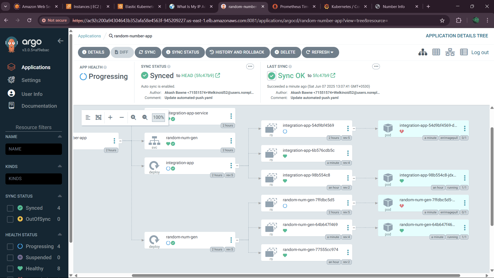

# random-number-EvenOrOdd
Application is Built using 2 microservices.
First app generates random number.
Second app fetch that random number and checks if it's Even Or Odd and prime or not.

TO RUN WORKFLOW 
FIRST RUN CI PIPELINE- it will ask for  input parameter (type version for docker image)
FOR CD PIPELINE - input same input parameters that will update manifest's docker images tag.
later ArgoCD can be added for continious monitoring, Prometheus + Grafana for monitoring.

