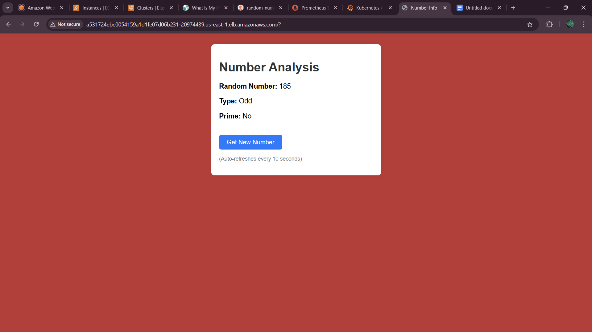
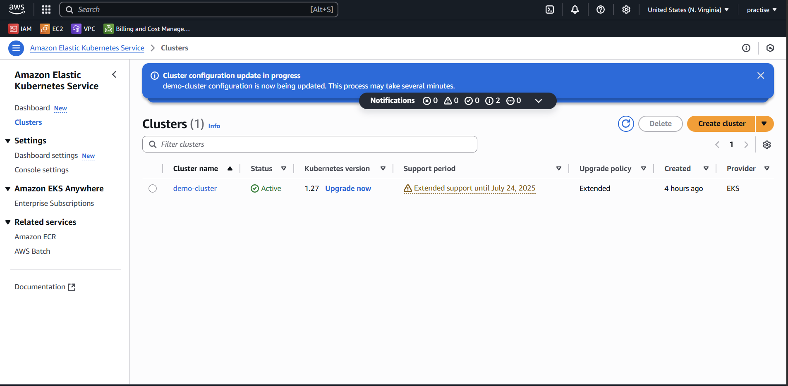
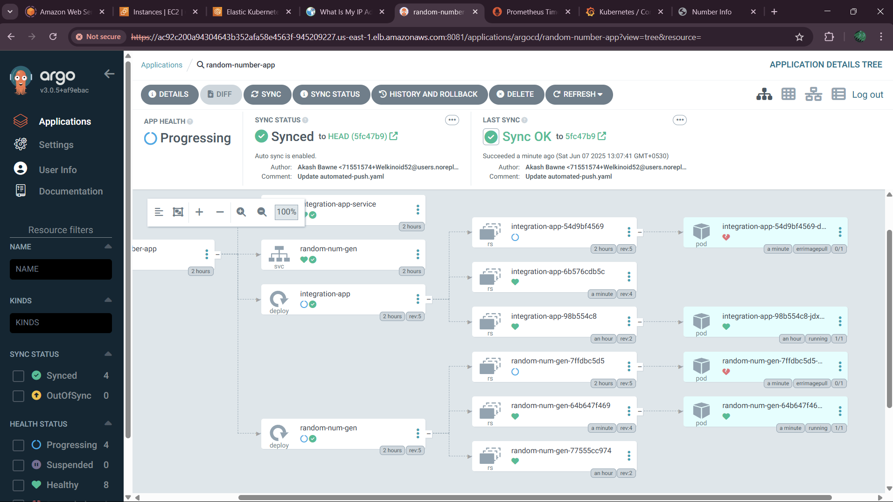
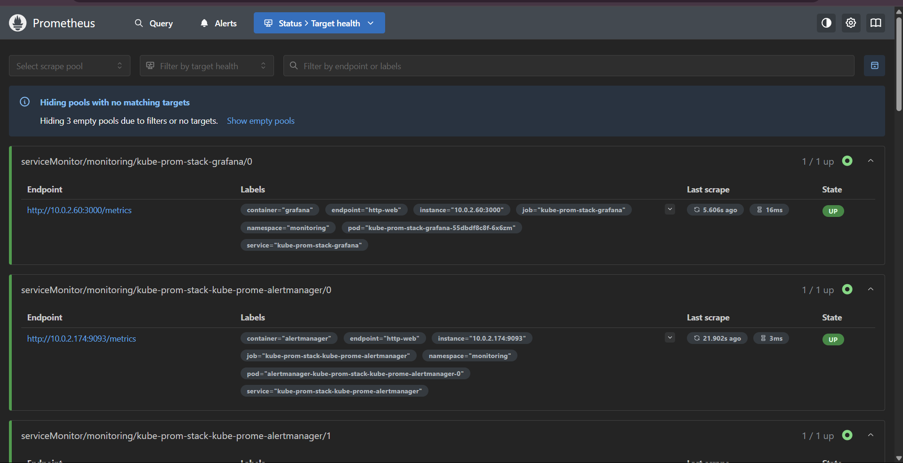
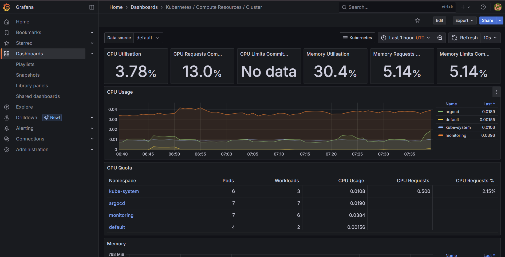

# random-number-EvenOrOdd
Application is Built using 2 microservices.
First app generates random number.
Second app fetch that random number and checks if it's Even Or Odd and prime or not.

TO RUN WORKFLOW 
<!-- FIRST RUN CI PIPELINE- it will ask for  input parameter (type version for docker image)
FOR CD PIPELINE - input same input parameters that will update manifest's docker images tag.
later ArgoCD can be added for continious monitoring, Prometheus + Grafana for monitoring. -->

Push code to the repo, workflow will-- Checkout code > Set up Docker Buildx > Log in to DockerHub > 
Build & push index service (backend) > Build & push client service (frontend) >  Update Kubernetes manifests with new image tags > Commit and push updated manifests.

BUT BEFORE THAT SETUP INFRA..

setup terraform (init, paln, apply) > goto EKS dashboard > cluster > networking > endpoints > set it to public( give your public IP to setup local connection) in GitHub actions setup dockerhub secrets. > execute ./setup-tools.sh to install all tools...

